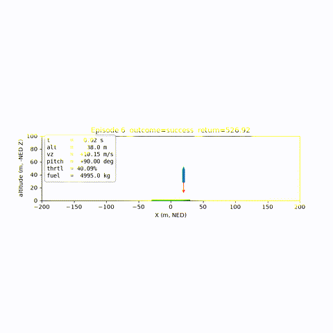
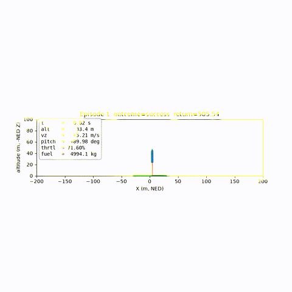
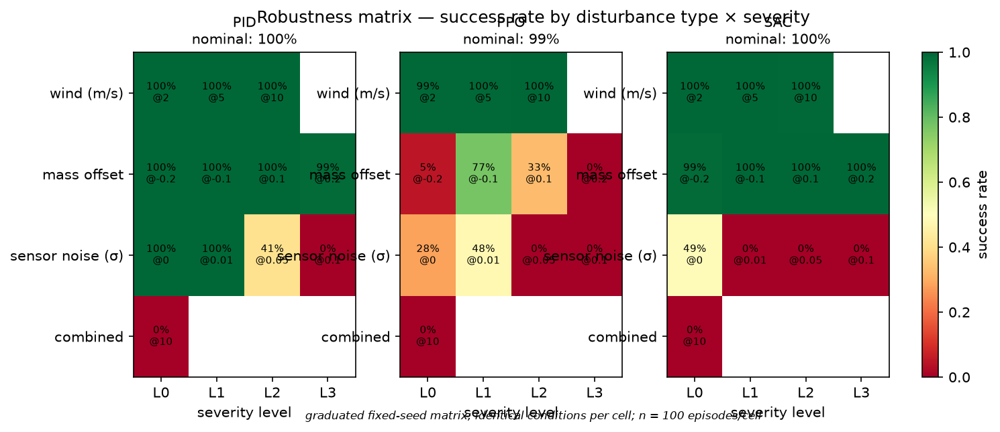
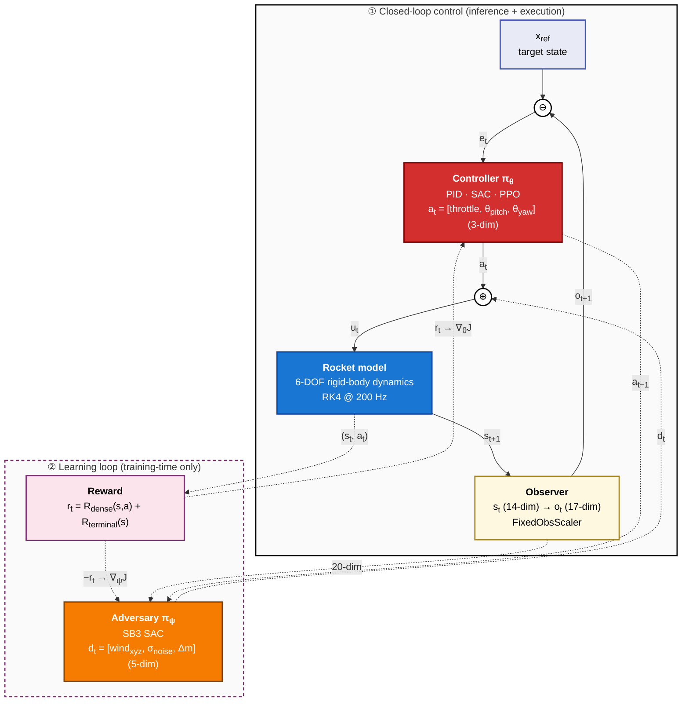

# ZetaBench


> **The reproducible benchmark for robust control under the long tail** —
> stress-test any controller across a physics-grounded graduated disturbance
> matrix and get certifiable, comparable evidence of where and how it fails.

**The question ZetaBench exists to answer:**
*"Is this controller robust enough to deploy, and can you prove it reproducibly?"*

ZetaBench is a physics-first robustness characterization environment for control
policies. Any controller — deep RL, MPC, LQR, PID, or world-model-based — faces
an identical graduated disturbance matrix (fixed seeds, identical conditions) and
produces a reproducible failure-mode map. Cross-paradigm comparison (RL vs. PID
vs. MPC on identical conditions) is the mechanism that makes the robustness
verdict credible, not the headline.

The **reference environment shipping today is 6-DOF rocket landing**, which
exercises the entire stack end to end: first-principles physics → Gymnasium env
→ PID / SAC / PPO controllers → disturbance-sweep evaluation. The same
scaffolding is intended to host other control problems (eVTOL/UAV precision
landing, bipedal locomotion) — see [Environments](#environments).

---

## Environments

| Environment | Status | Description |
|---|---|---|
| **Rocket landing** (`RocketLanding-v0`) | ✅ Available | 6-DOF rigid-body powered descent; the reference environment the rest of this README documents. |
| eVTOL / UAV precision landing | 🧭 Roadmap (post-v1.0) | A second flight-domain environment to validate shared abstractions and cross-domain robustness comparison — sequenced after the rocket-landing verdict is hardened (see [Interpretation & honest caveats](#interpretation--honest-caveats)). |
| Bipedal locomotion under perturbation | 🧭 Roadmap | Legged locomotion reference for disturbance characterization in contact-rich dynamics. |
| Your environment | 🧭 Roadmap | See [`CONTRIBUTING.md`](CONTRIBUTING.md) → *Adding an environment*. |

**Extension points** a new environment builds against: the
`dynamics.base.RocketDynamics` contract (`step()` + `get_params()`), a standard
Gymnasium `gym.Env` in `envs/`, and Hydra config groups under `configs/`. A
domain-neutral `BaseDynamics` split and an env registry are planned; today the
rocket environment is the worked example to follow.

---

## Demo

Best-episode powered descents at task difficulty 0.4 (a ~40 m, off-pad
approach). Both land within the 3.0 m/s touchdown gate.

| PID baseline | SAC (curriculum-trained) | PPO (curriculum-trained) |
|---|---|---|
|  |  |  |

[📊 Full wandb dashboard →](https://wandb.ai/b-badkoubeh-baudcomatics/zeta-bench)

---

## Key Results

> **Honest headline.** On this vertical-descent task a **well-tuned classical
> PID matches or beats deep RL** — it ties SAC across the physical-disturbance
> matrix and leads overall (PID 82% vs SAC 65% vs PPO 60% mean success). RL does
> not "win" here because the task, as scored, is descent-rate regulation that
> does not require RL-class capability. That is the benchmark working as
> intended; see the caveats below.

All three controllers share one evaluation protocol — 100 episodes per cell,
fixed seed, 3.0 m/s touchdown gate — on the graduated disturbance matrix at a
fixed, fair initial-condition envelope (task difficulty 0.4, where all three
are 100% under nominal conditions). PID is a fixed-gain classical baseline;
SAC and PPO are curriculum-trained (γ=0.999, staged warm-start).



| Disturbance | PID | SAC | PPO |
|---|---|---|---|
| none (nominal) | **100%** | **100%** | 99% |
| wind (≤ 10 m/s) | **100%** | **100%** | **100%** |
| mass offset (± 20%) | **100%** | **100%** | 29% |
| sensor noise | **56%** | 9% | 18% |
| combined (max) | 0% | 0% | 0% |
| **mean (32 cells)** | **81.9%** | 65.4% | 59.7% |

**➡ [Full results — per-controller tables across the difficulty envelope,
matrix breakdown, and interpretation](results/README.md)**

### Interpretation & honest caveats

The headline is deliberately unflattering to deep RL — that is the point of a
credible benchmark. The four caveats that keep it honest:

- **The task, as scored, does not require RL-class capability** — success is a
  soft *vertical* touchdown; no controller here performs lateral (on-pad)
  guidance. A tuned PID solves descent-rate regulation by design.
- **The RL agents are nominal-trained** — they never saw a disturbance in
  training; the naive-vs-robust retrain is the next experiment, not an assumed
  outcome.
- **`task_difficulty` is not a controller-agnostic hardness axis** — taller
  drops give the descent-rate PID *more* settling runway; the fixed-difficulty
  disturbance matrix is the cleaner cross-paradigm axis.
- **RL's clear structural weakness is observation noise** — a memoryless MLP on
  a raw noisy frame; a genuine architectural finding, not a training-budget
  artifact.

The full interpretation, what the result does and doesn't establish, and the
ordered next steps (naive-vs-robust retrain, precision on-pad landing, LQR/MPC
baseline) are in [results/README.md](results/README.md#interpretation--honest-caveats).

---

## Quickstart

```bash
cd zeta-bench
uv venv --python 3.12 && source .venv/bin/activate
uv pip install -e ".[dev]"            # PID eval + tests; add [train] for torch + SB3

python experiments/evaluate_pid.py               # fly the PID baseline, write metrics
python experiments/evaluate_robustness.py        # the graduated disturbance matrix
python experiments/train.py compute=mps agent=sac   # train (Apple Silicon example)
```

Training profiles (CUDA, SageMaker fan-out, domain randomisation), rendering,
evaluation of trained checkpoints, per-controller robustness cards, and the
full config reference: **[docs/usage.md](docs/usage.md)**.

---

## Architecture

```
zeta-bench/
├── configs/                  # All hyperparams — Hydra-managed YAML
├── dynamics/                 # 6-DOF rigid body dynamics (first principles)
├── envs/                     # Gymnasium environment wrapper
├── controllers/              # PID baseline, SAC agent, PPO agent
├── adversary/                # Learned disturbance adversary policy
├── experiments/              # train.py, evaluate_robustness.py
├── notebooks/                # Physics derivation (EOM from scratch)
├── tests/                    # Physics correctness + environment unit tests
└── results/                  # Checkpoints, videos, eval tables + full results report
```

### Closed-loop control architecture (rocket-landing reference environment)

The diagram below is the authoritative signal-flow spec for the rocket-landing
reference environment. Other environments reuse the same topology (controller →
plant → observer feedback, with a training-time reward + adversary loop) but
substitute their own dynamics, observation/action spaces, and reward.



> **Notation.** ⊖ marks a subtractive summing junction (`e_t = x_ref − o_t`);
> ⊕ marks additive (`u_t = a_t + d_t`). The setpoint `x_ref` in ① is a
> *conceptual* input — in the actual code path the controller consumes `o_t`
> directly and the reference is encoded inside `R_dense` and `R_terminal`;
> the explicit ⊖ makes the control-theoretic interpretation visible without
> misrepresenting what the policy net does. Dashed edges in ② carry
> training-time signals only (reward, policy gradients, adversary
> disturbance). The adversary observation is 20-dim = 17-dim observer output
> + 3-dim previous controller action. Frames: NED inertial / FRD body;
> attitude stored as a unit quaternion, Euler angles exposed in `o_t`.

> **Diagram maintenance.** This diagram is the authoritative visual
> specification of the system's signal flow. Update it whenever you change:
>
> - Action space (`envs/rocket_landing_env.py` action_space, `dynamics/types.py::ACTION_DIM`)
> - Observation space (env `observation_space`, slot semantics)
> - Adversary action / obs spaces (`adversary/adversary_policy.py`)
> - Dynamics signature (`dynamics/base.py::RocketDynamics`)
> - Reward decomposition (`configs/reward.yaml`)
> - New module inserted into the loop (world model, RNN policy, additional sensors)
>
> A `pre-commit` hook (`make install-hooks`) blocks commits that touch these
> files without updating this README; a GitHub Actions check surfaces the same
> reminder on pull requests.

### Reward

The reward is `r_t = R_dense(s, a) + R_terminal(s)`, with every weight in
`configs/reward.yaml` (companion guide: `docs/reward_engineering.md`).

- **`R_dense` — potential-based shaping.** A distance-to-goal potential `Φ(s)`
  guides the descent without changing the optimal policy (PBRS invariance). It
  includes a **near-pad landing-speed term** gated by
  `gate = exp(-altitude / ground_gate_altitude_m)` (≈1 at touchdown, decaying
  with altitude), which pushes the agent to bleed off speed during the final
  flare. Because that term is zero at the landed, zero-speed state, the potential
  optimum is unchanged and the shaping stays PBRS-safe.
- **`R_terminal` — impact-aware outcome.** Success pays a fixed bonus; a crash
  penalty scales with touchdown **speed, tilt, angular rate, and lateral error**
  rather than being flat, and out-of-bounds is pinned as the worst outcome so a
  policy can never make fleeing the box cheaper than a hard landing.

---

## Physics

The dynamics are derived from first principles in
[`notebooks/physics_derivation.ipynb`](notebooks/physics_derivation.ipynb),
covering:

- **Translational dynamics** — Newton's second law in inertial frame; thrust,
  gravity, and aerodynamic drag
- **Rotational dynamics** — Euler's equations; moment of inertia tensor; gimbal
  abstraction for thrust vectoring
- **Reference frames** — body-to-inertial rotation via quaternion / DCM
- **Parameter grounding** — mass, Isp, drag coefficient from RocketPy

---

## Robustness Evaluation

### Primary mode — graduated disturbance matrix

Every controller faces an identical, fixed-seed disturbance matrix. Conditions
are held constant across controllers so results are directly comparable and
reproducible. This is the primary evaluation path and produces the signature
robustness heatmap (disturbance type × severity × success rate). Each row below
is graduated by `disturbance_severity` — the magnitude axis of an external
disturbance, kept distinct from `task_difficulty` (the nominal initial-condition
envelope).

| Disturbance | Severity levels tested | How it enters the physics |
|---|---|---|
| Wind | 0, 2, 5, 10 m/s × N/E/S/W/diagonal | relative airspeed in the drag term (`v_air = v − v_wind`) |
| Mass uncertainty | payload offset −20 % to +20 % | scales the vehicle dry mass |
| Sensor noise | σ 0–0.1, spike probability 0–5 % | Gaussian + spikes on the observation |
| Combined | all at maximum simultaneously | all of the above at once |

Wind is modelled as a moving air mass, so it acts through the physically honest
relative-airspeed drag term (which is why the grid is specified in m/s), not as
an arbitrary force. Run it with `python experiments/evaluate_robustness.py`;
outputs land in `results/` with per-cell sample counts, and
`python experiments/robustness_card.py` turns the matrix into per-controller
degradation curves with break-point severities (see
[docs/usage.md](docs/usage.md)).

### Optional — adversarial / worst-case search

A learned adversary (SB3 SAC) searches for the disturbance within physical
bounds that most reliably breaks a given controller. This is a stress-test for a
*single* controller, not a cross-controller comparison tool — because an adaptive
adversary fights each controller differently, its findings are not comparable
across controllers. Adversarial results are always reported separately from the
graduated matrix. (Adversarial training is scaffolded but not yet wired —
`train_mode=adversarial` raises `NotImplementedError`.)

---

## Limitations

This section documents honest constraints of the current implementation.

**Physics fidelity**
- Moderate fidelity: aerodynamic drag is simplified to a scalar coefficient;
  no pressure-varying aero model
- Gimbal actuator dynamics are abstracted away; no bandwidth or saturation model
- Fuel mass depletion is tracked but does not feed back into the inertia tensor

**Training**
- Training-time domain randomisation is implemented as a config-gated wrapper
  (`env.domain_randomization`, off by default) and is the supported way to harden a
  policy across the disturbance distribution; the learned adversary is scaffolded but
  not yet wired (`train_mode=adversarial` raises `NotImplementedError`)
- Domain randomisation defaults to off, so headline results are trained on nominal
  dynamics unless a run explicitly enables it
- Trained in simulation only — no sim-to-real gap analysis or hardware validation
- Single GPU training; no distributed rollout collection

**Evaluation**
- Robustness matrix uses discrete disturbance levels; real-world disturbances
  are continuous and correlated
- No formal stability guarantees — empirical robustness only

**Prior art.** Existing tools are not absent — they are fragmented and
unmaintained as a standard. ZetaBench's gap is the absence of a recognized,
physics-first robustness standard for learned controllers. Related work worth
knowing: [safe-control-gym](https://github.com/utiasDSL/safe-control-gym),
[RRLS](https://github.com/SuReLI/RRLS), [SafetyGym](https://github.com/openai/safety-gym),
[RotorPy](https://github.com/spencerfolk/rotorpy); enterprise CAE/HIL platforms
(Ansys, OPAL-RT, dSPACE, Simulink) are trusted but closed and not
learned-policy-native.

**Rocket landing as demo.** The rocket-landing environment is a rigorous,
physics-grounded reference for the characterization framework. Real operators
(e.g., SpaceX) land via convex optimization (SOCP); RL trails deterministic
controllers on terminal accuracy. The demo is chosen for its well-defined physics
and clear success criterion, not as a claim about deployed practice.

---

## Background

ZetaBench addresses the fragmentation and reproducibility gap in robustness
evaluation for learned controllers. Academic gyms exist but lack maintained
standards; enterprise CAE tools are trusted but closed and not learned-policy-native.
The gap is not the absence of tools — it is the absence of a recognized,
physics-first robustness standard that treats classical and learned controllers
as first-class peers. ZetaBench is built on control-systems foundations
(PDEs, Lyapunov, H∞, robust RL under disturbance/uncertainty) and production
ML engineering (reproducibility, CI/CD, seeded evaluation).

---

## License

MIT
