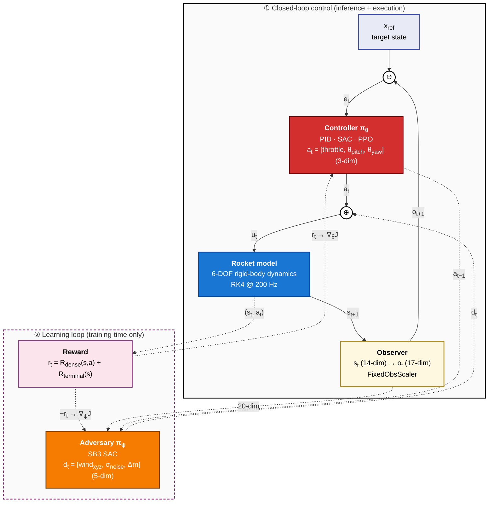

# Zeta RL


> **Physics-grounded RL simulation environments for robust control under
> uncertainty** — dynamics derived from first principles, agents evaluated
> across disturbances and model uncertainty.

Zeta RL is a framework for building physics-first reinforcement-learning
environments and training robust agents in them. It pairs first-principles
dynamics with a standard Gymnasium interface, swappable controllers (classical
and learned), adversarial robustness training, and a reproducible evaluation
harness.

The **reference environment shipping today is 6-DOF rocket landing**, which
exercises the entire stack end to end: first-principles physics → Gymnasium env
→ PID / SAC / PPO controllers → learned-adversary robustness training →
disturbance-sweep evaluation. The same scaffolding is intended to host other
control problems (autonomous driving, LLM post-training, …) — see
[Environments](#environments).

---

## Environments

| Environment | Status | Description |
|---|---|---|
| **Rocket landing** (`RocketLanding-v0`) | ✅ Available | 6-DOF rigid-body powered descent; the reference environment the rest of this README documents. |
| Autonomous driving (bicycle / vehicle model) | 🧭 Roadmap | A second control domain to validate the shared abstractions. |
| LLM post-training | 🧭 Roadmap | RL post-training loop expressed against the same env/agent surface. |
| Your environment | 🧭 Roadmap | See [`CONTRIBUTING.md`](CONTRIBUTING.md) → *Adding an environment*. |

**Extension points** a new environment builds against: the
`dynamics.base.RocketDynamics` contract (`step()` + `get_params()`), a standard
Gymnasium `gym.Env` in `envs/`, and Hydra config groups under `configs/`. A
domain-neutral `BaseDynamics` split and an env registry are planned; today the
rocket environment is the worked example to follow.

---

## Demo

<!-- Fill in after Phase 3 -->
| Naive SAC | Adversarially-Trained SAC |
|---|---|
|  |  |

[📊 Full wandb report →](https://wandb.ai/badkoubeh/zeta-rl)

---

## Key Results

<!-- Fill in after Phase 3 -->

### Landing Success Rate (Nominal Conditions)

| Controller | Success Rate | Touchdown Velocity (m/s) | Fuel Consumed (%) |
|---|---|---|---|
| PID Baseline | — | — | — |
| PPO | — | — | — |
| SAC (nominal) | — | — | — |
| SAC (adversarial) | — | — | — |

### Robustness Matrix — Success Rate Under Disturbance

<!-- Fill in from results/robustness_matrix.csv after Phase 3 -->

| Disturbance | PID | PPO | SAC Nominal | SAC Adversarial |
|---|---|---|---|---|
| Wind 5 m/s | — | — | — | — |
| Wind 10 m/s | — | — | — | — |
| Mass +20% | — | — | — | — |
| Sensor noise σ=0.1 | — | — | — | — |
| Combined (max) | — | — | — | — |

---

## Architecture

```
zeta-rl/
├── configs/                  # All hyperparams — Hydra-managed YAML
├── dynamics/                 # 6-DOF rigid body dynamics (first principles)
├── envs/                     # Gymnasium environment wrapper
├── controllers/              # PID baseline, SAC agent, PPO agent
├── adversary/                # Learned disturbance adversary policy
├── experiments/              # train.py, evaluate_robustness.py
├── notebooks/                # Physics derivation (EOM from scratch)
├── tests/                    # Physics correctness + environment unit tests
└── results/                  # Checkpoints, videos, eval tables
```

### Closed-loop control architecture (rocket-landing reference environment)

The diagram below is the authoritative signal-flow spec for the rocket-landing
reference environment. Other environments reuse the same topology (controller →
plant → observer feedback, with a training-time reward + adversary loop) but
substitute their own dynamics, observation/action spaces, and reward.



> **Notation.** ⊖ marks a subtractive summing junction (`e_t = x_ref − o_t`);
> ⊕ marks additive (`u_t = a_t + d_t`). The setpoint `x_ref` in ① is a
> *conceptual* input — in the actual code path the controller consumes `o_t`
> directly and the reference is encoded inside `R_dense` and `R_terminal`;
> the explicit ⊖ makes the control-theoretic interpretation visible without
> misrepresenting what the policy net does. Dashed edges in ② carry
> training-time signals only (reward, policy gradients, adversary
> disturbance). The adversary observation is 20-dim = 17-dim observer output
> + 3-dim previous controller action. Frames: NED inertial / FRD body;
> attitude stored as a unit quaternion, Euler angles exposed in `o_t`.

> **Diagram maintenance.** This diagram is the authoritative visual
> specification of the system's signal flow. Update it whenever you change:
>
> - Action space (`envs/rocket_landing_env.py` action_space, `dynamics/types.py::ACTION_DIM`)
> - Observation space (env `observation_space`, slot semantics)
> - Adversary action / obs spaces (`adversary/adversary_policy.py`)
> - Dynamics signature (`dynamics/base.py::RocketDynamics`)
> - Reward decomposition (`configs/reward.yaml`)
> - New module inserted into the loop (world model, RNN policy, additional sensors)
>
> A `pre-commit` hook (`make install-hooks`) blocks commits that touch these
> files without updating this README; a GitHub Actions check surfaces the same
> reminder on pull requests.

---

## Physics

The dynamics are derived from first principles in
[`notebooks/physics_derivation.ipynb`](notebooks/physics_derivation.ipynb),
covering:

- **Translational dynamics** — Newton's second law in inertial frame; thrust,
  gravity, and aerodynamic drag
- **Rotational dynamics** — Euler's equations; moment of inertia tensor; gimbal
  abstraction for thrust vectoring
- **Reference frames** — body-to-inertial rotation via quaternion / DCM
- **Parameter grounding** — mass, Isp, drag coefficient from RocketPy

---

## Robustness Strategy

The agent trains against a **learned adversary** that injects worst-case
disturbances during training — a reinforcement-learning formulation of H∞ robust
control. The adversary learns to maximise landing failure; the agent learns
to land despite it.

**Adversary action space:**
- Wind force vector `[Fx, Fy, Fz]`
- Sensor noise magnitude
- Payload mass offset

This produces an agent that is provably harder to destabilise than one trained
with fixed domain randomisation.

---

## Getting Started

### Prerequisites

- **Python ≥ 3.12** and **git**.
- **No system ffmpeg required** — the MP4 renderer uses the binary bundled with
  `imageio-ffmpeg`.

### 1. Set up the environment

This project is configured via `pyproject.toml` (with `[dev]` / `[train]` extras).
The recommended setup uses [uv](https://docs.astral.sh/uv/):

```bash
cd zeta-rl
uv venv --python 3.12            # create .venv with Python 3.12
source .venv/bin/activate
uv pip install -e ".[dev]"       # runtime + dev deps (the PID path needs no torch)

# Linux / Apple Silicon only — install the RL training stack (torch + SB3):
#   uv pip install -e ".[dev,train]"
```

> `requirements.lock` is a pinned Linux / py3.12 lockfile used by Docker and CI.
> To reproduce that exact dependency set on Linux: `uv pip sync requirements.lock`.
> The `uv pip install -e ".[dev]"` line above is the cross-platform dev path.

<details>
<summary>No <code>uv</code>? Use the stdlib venv + pip</summary>

```bash
cd zeta-rl
python3.12 -m venv .venv
source .venv/bin/activate
pip install -e ".[dev]"
```
</details>

### 2. Run the working experiment — PID baseline eval

The PID baseline is the fully implemented end-to-end path. It builds the
environment, flies the cascaded PID controller, and writes per-episode metrics.

```bash
python experiments/evaluate_pid.py                                  # 10 episodes, full envelope
python experiments/evaluate_pid.py seed=7 eval_pid.n_episodes=20    # more episodes, different seed
python experiments/evaluate_pid.py eval_pid.curriculum_progress=0.0 # easiest envelope (low drop, no lateral offset)
make eval-pid SEED=42                                               # Makefile shortcut (runs locally)
```

### 3. Render videos and plots

```bash
python experiments/evaluate_pid.py eval_pid.render=true eval_pid.render_fps=50
make viz SEED=42                                                    # shortcut for the above
```

Outputs land in `results/{run_name}/`, where `run_name = pid_moderate_eval_{seed}`:

```
results/pid_moderate_eval_42/
├── episodes.csv                       # one row per episode (outcome, return, touchdown speed, fuel)
├── summary.json                       # aggregate stats (success rate, means, ...)
├── plots/timeseries_ep{idx}_{outcome}.png   # best/worst episode time series (render=true)
└── video/landing_ep{idx}_{outcome}.mp4      # 2D side-view animation        (render=true)
```

Rendering is **off by default** so the tune-and-rerun loop stays fast — MP4
generation is the slow step.

### 4. Run the tests

```bash
pytest tests/ -v                 # full suite (enforces a 90% coverage gate)
pytest tests/test_physics.py -v  # physics invariants only
```

### Not yet runnable (Phase 4)

The RL training and robustness-sweep entrypoints are **stubs that currently raise
`NotImplementedError`** — they document the intended interface but are not wired
up yet:

```bash
python experiments/train.py --config-name train seed=42                # ❌ stub (Phase 4)
python experiments/train.py --config-name train agent=ppo seed=42      # ❌ stub (Phase 4)
python experiments/evaluate_robustness.py checkpoint=results/sac_moderate_adversarial_42/  # ❌ stub (Phase 4)
```

The `make train` / `make eval` targets invoke these inside Docker and will fail
until the agents are implemented.

All results, checkpoints, and videos are saved to `results/{run_name}/`.

---

## Configuration

All hyperparameters are config-driven (Hydra) — nothing is hardcoded. Override
any parameter at the command line:

```bash
# Working today (PID eval):
python experiments/evaluate_pid.py eval_pid.n_episodes=20
python experiments/evaluate_pid.py eval_pid.curriculum_progress=0.5
python experiments/evaluate_pid.py seed=123

# Future interface (training — Phase 4 stub):
python experiments/train.py dynamics.fidelity=high
python experiments/train.py agent.sac.learning_rate=3e-4
python experiments/train.py curriculum.anneal_steps=500000
```

Config files:
- `configs/train.yaml` — top-level training composition (Phase 4)
- `configs/eval_pid.yaml` — PID baseline eval composition (entry point today)
- `configs/env.yaml` — environment and dynamics parameters
- `configs/reward.yaml` — all reward weights
- `configs/pid_controller.yaml` — PID gains
- `configs/adversary.yaml` — adversary hyperparameters
- `configs/agent/sac.yaml` — SAC hyperparameters
- `configs/agent/ppo.yaml` — PPO hyperparameters

---

## Experiment Tracking

All runs are tracked in [Weights & Biases](https://wandb.ai).

```bash
# Logged automatically per run:
# - All reward components (separately, not just total)
# - Curriculum difficulty level
# - Agent + adversary losses
# - Landing success rate, touchdown velocity, fuel consumption
# - Full robustness matrix as wandb Table
```

---

## Testing

```bash
pytest tests/ -v                 # all tests
pytest tests/test_physics.py -v  # physics correctness only
```

Coverage is configured in `pyproject.toml` and runs automatically: a **90%
branch-coverage gate** spanning `dynamics`, `envs`, `controllers`, and `utils`,
with an HTML report written to `htmlcov/`.

Tests cover:
- Energy conservation across dynamics integration
- Thrust vector bounds and normalisation
- Observation space shape and bounds
- Reward range sanity
- Agent checkpoint save/load

---

## Limitations

This section documents honest constraints of the current implementation.

**Physics fidelity**
- Moderate fidelity: aerodynamic drag is simplified to a scalar coefficient;
  no pressure-varying aero model
- Gimbal actuator dynamics are abstracted away; no bandwidth or saturation model
- Fuel mass depletion is tracked but does not feed back into the inertia tensor

**Training**
- Adversarial training can be unstable; if agent and adversary diverge,
  domain randomisation is the fallback
- Trained in simulation only — no sim-to-real gap analysis or hardware validation
- Single GPU training; no distributed rollout collection

**Evaluation**
- Robustness matrix uses discrete disturbance levels; real-world disturbances
  are continuous and correlated
- No formal stability guarantees — empirical robustness only

---

## Upgrade Paths

| Upgrade | Effort | What changes |
|---|---|---|
| High fidelity dynamics | Medium | New `HighFidelityDynamics` subclass + obs extension |
| Transformer policy | Medium | Swap MLP backbone in SAC/PPO |
| Bicycle model (Waymo) | Medium | New dynamics class + new env wrapper |
| CARLA simulator | High | Replace Gymnasium env; rest unchanged |

---

## Background

Built as a portfolio project demonstrating:
- Physics-first thinking (equations of motion from scratch)
- Robust control under uncertainty (adversarial RL ≈ learned H∞)
- Production engineering standards (config, CI, tracking, reproducibility)
- Empirical benchmarking (PID vs PPO vs SAC across disturbance conditions)

---

## License

MIT
