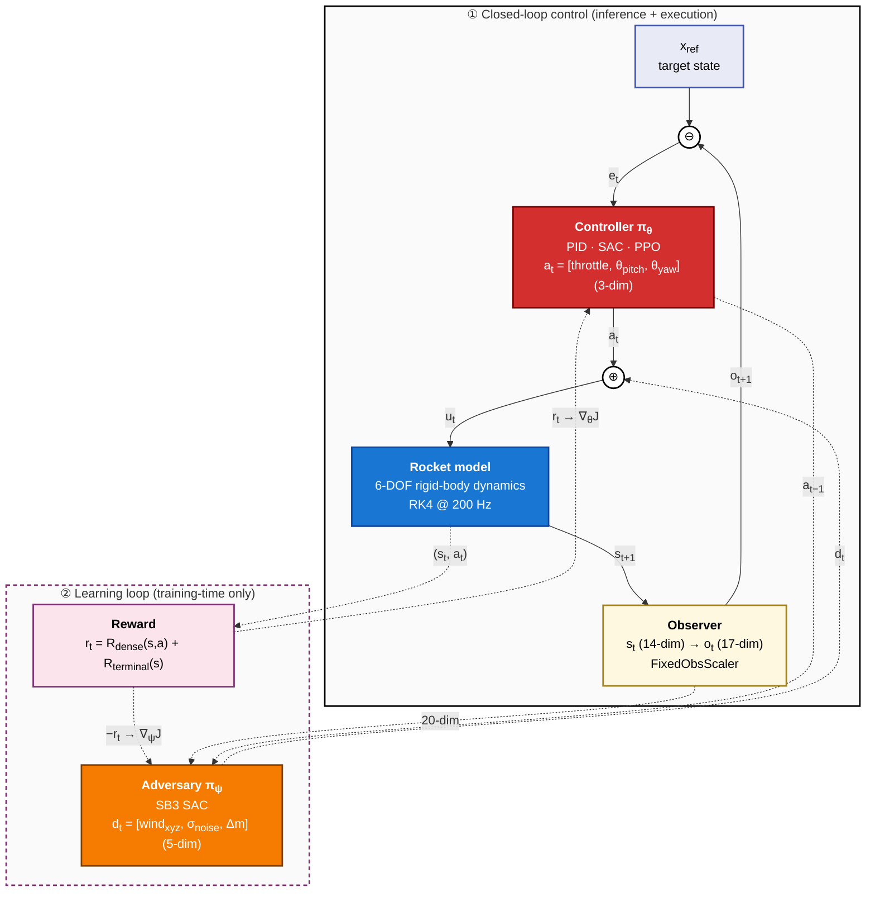

# ZetaBench


> **The reproducible benchmark for robust control under the long tail** —
> stress-test any controller across a physics-grounded graduated disturbance
> matrix and get certifiable, comparable evidence of where and how it fails.

**The question ZetaBench exists to answer:**
*"Is this controller robust enough to deploy, and can you prove it reproducibly?"*

ZetaBench is a physics-first robustness characterization environment for control
policies. Any controller — deep RL, MPC, LQR, PID, or world-model-based — faces
an identical graduated disturbance matrix (fixed seeds, identical conditions) and
produces a reproducible failure-mode map. Cross-paradigm comparison (RL vs. PID
vs. MPC on identical conditions) is the mechanism that makes the robustness
verdict credible, not the headline.

The **reference environment shipping today is 6-DOF rocket landing**, which
exercises the entire stack end to end: first-principles physics → Gymnasium env
→ PID / SAC / PPO controllers → disturbance-sweep evaluation. The same
scaffolding is intended to host other control problems (eVTOL/UAV precision
landing, bipedal locomotion) — see [Environments](#environments).

---

## Environments

| Environment | Status | Description |
|---|---|---|
| **Rocket landing** (`RocketLanding-v0`) | ✅ Available | 6-DOF rigid-body powered descent; the reference environment the rest of this README documents. |
| eVTOL / UAV precision landing | 🧭 Roadmap (post-v1.0) | A second flight-domain environment to validate shared abstractions and cross-domain robustness comparison — sequenced after the rocket-landing verdict is hardened (see [Interpretation & honest caveats](#interpretation--honest-caveats)). |
| Bipedal locomotion under perturbation | 🧭 Roadmap | Legged locomotion reference for disturbance characterization in contact-rich dynamics. |
| Your environment | 🧭 Roadmap | See [`CONTRIBUTING.md`](CONTRIBUTING.md) → *Adding an environment*. |

**Extension points** a new environment builds against: the
`dynamics.base.RocketDynamics` contract (`step()` + `get_params()`), a standard
Gymnasium `gym.Env` in `envs/`, and Hydra config groups under `configs/`. A
domain-neutral `BaseDynamics` split and an env registry are planned; today the
rocket environment is the worked example to follow.

---

## Demo

Best-episode powered descents at task difficulty 0.4 (a ~40 m, off-pad
approach), rendered with `experiments/evaluate_{rl,pid}.py … render=true`.
Both land within the 3.0 m/s touchdown gate.

| PID baseline | SAC (curriculum-trained) | PPO (curriculum-trained) |
|---|---|---|
|  |  |  |

[📊 Full wandb dashboard →](https://wandb.ai/b-badkoubeh-baudcomatics/zeta-bench)

---

## Key Results

> **Honest headline.** On this vertical-descent task a **well-tuned classical
> PID matches or beats deep RL** — it ties SAC across the physical-disturbance
> matrix and leads overall (PID 82% vs SAC 65% vs PPO 60% mean success). RL does
> not "win" here because the task, as scored, is descent-rate regulation that
> does not require RL-class capability. That is the benchmark working as
> intended; see **[Interpretation & honest
> caveats](#interpretation--honest-caveats)**.

> **Protocol.** All three controllers share one evaluation protocol — 100
> episodes per cell, fixed seed (42), 3.0 m/s touchdown gate — so the results
> are directly comparable. PID is a fixed-gain classical baseline (no
> training); SAC and PPO are curriculum-trained to task difficulty 0.3
> (γ=0.999, staged warm-start) under the same reward these tables report. The
> tables in this section evaluate under **nominal** conditions across graduated
> task difficulty. Results current as of July 2026.
>
> **Robustness axis.** The tables here vary *task difficulty*. A separate
> **[Robustness under graduated disturbances](#robustness-under-graduated-disturbances-fair-envelope)**
> section below adds the orthogonal *disturbance* matrix (wind, mass, sensor
> noise) at a fixed, fair difficulty-0.4 envelope using the same agents.

### Landing Success Rate vs Task Difficulty (SAC, nominal)

`task_difficulty` linearly anneals the initial-condition envelope from a
near-vertical ~30 m drop (`0.0`) toward a 60 m, 20 m/s, ±50 m off-pad approach
(`1.0`). 100 episodes per cell, seed 42, touchdown threshold 3.0 m/s, 5000 kg
landing-burn reserve. The agent was trained up to task_difficulty 0.3; levels beyond
that probe its zero-shot generalization to harder, unseen approaches.

| Task difficulty [0,1] | Success | Crash | OOB | Touchdown (m/s) | Fuel used (%) | Episode len |
|---|---|---|---|---|---|---|
| 0.0 (near-vertical) | **100%** | 0 | 0 | 2.48 | 13% | 291 |
| 0.1 | **100%** | 0 | 0 | 2.14 | 13% | 282 |
| 0.2 | 99% | 1 | 0 | 2.17 | 13% | 283 |
| 0.3 (train ceiling) | **100%** | 0 | 0 | 1.97 | 13% | 291 |
| 0.4 | **100%** | 0 | 0 | 1.92 | 14% | 296 |
| 0.5 | 98% | 2 | 0 | 1.94 | 14% | 300 |
| 0.6 | 97% | 3 | 0 | 1.90 | 15% | 305 |
| 0.8 | 92% | 8 | 0 | 1.97 | 15% | 314 |
| 1.0 (hardest) | 86% | 14 | 0 | 2.23 | 16% | 325 |

The agent is **~100% within its training envelope (≤0.4)** and degrades
gracefully beyond it — still 97% at 0.6, 92% at 0.8, and 86% at the hardest
full-envelope approach despite never training there. Crucially, **out-of-bounds
is 0 at every level** and touchdown speed stays well under the 3.0 m/s gate
(≤2.5 m/s throughout): the rare failures are gentle soft-braking crashes, never
loss-of-control fly-out.

**Training notes.** Two choices mattered. A discount factor of **γ=0.999** puts
the effective horizon (~1000 steps) beyond typical episode length, keeping the
terminal landing / out-of-bounds reward visible to the optimizer and closing off
a fly-up→out-of-bounds local optimum that otherwise caps success. A staged
curriculum warm-start (fixed difficulty 0.1 → 0.2 → 0.3) then makes the policy
markedly more efficient: at difficulty 0.2, versus a single-stage policy, it
lifts success from 60% to 100% while cutting episode length from ~1180 to ~250
steps and fuel burn from 49% to 12%.

### PPO (nominal)

PPO was trained with the identical γ=0.999 setting and the same staged
curriculum warm-start (fixed difficulty 0.0 → 0.1 → 0.2 → 0.3), and evaluated
under the same protocol as SAC.

| Task difficulty [0,1] | Success | Crash | OOB | Touchdown (m/s) | Fuel used (%) | Episode len |
|---|---|---|---|---|---|---|
| 0.0 (near-vertical) | **100%** | 0 | 0 | 2.41 | 12% | 266 |
| 0.1 | 99% | 1 | 0 | 2.42 | 12% | 272 |
| 0.2 | **100%** | 0 | 0 | 2.36 | 13% | 281 |
| 0.3 (train ceiling) | **100%** | 0 | 0 | 2.18 | 13% | 290 |
| 0.4 | 99% | 1 | 0 | 2.11 | 14% | 299 |
| 0.5 | **100%** | 0 | 0 | 1.94 | 15% | 310 |
| 0.6 | **100%** | 0 | 0 | 1.82 | 15% | 321 |
| 0.8 | 85% | 3 | 0 | 1.91 | 26% | 588 |
| 1.0 (hardest) | 63% | 16 | 0 | 3.47 | 34% | 792 |

PPO holds **100% through difficulty 0.6** — further out-of-envelope than SAC —
then degrades on the largest approaches. Like SAC it shows **zero
out-of-bounds at every level**; the shortfall at
0.8–1.0 is dominated by **timeouts on long, fuel-limited descents** (episode
length and fuel climb sharply — 792 steps / 34% fuel at 1.0) rather than
loss-of-control.

### PID baseline (nominal)

The classical PID controller has **fixed gains** — no training, no curriculum —
a single descent-rate loop with an **altitude-scheduled flare** (target descent
= 0.10 · altitude, clamped to [1.0, 8.0] m/s) so it slows progressively toward
the pad. Properly tuned, it lands the **entire envelope at 100%** with soft,
monotonically decreasing touchdown speeds and zero out-of-bounds / zero timeout.
(The flare matters: a constant-target loop cannot bleed enough speed to reach
the gate on a short 30 m drop.)

| Task difficulty [0,1] | Success | Crash | OOB | Touchdown (m/s) | Fuel used (%) | Episode len |
|---|---|---|---|---|---|---|
| 0.0 (near-vertical) | **100%** | 0 | 0 | 1.96 | 14% | 307 |
| 0.1 | **100%** | 0 | 0 | 1.63 | 15% | 339 |
| 0.2 | **100%** | 0 | 0 | 1.39 | 17% | 378 |
| 0.3 | **100%** | 0 | 0 | 1.23 | 19% | 425 |
| 0.4 | **100%** | 0 | 0 | 1.14 | 21% | 477 |
| 0.5 | **100%** | 0 | 0 | 1.08 | 24% | 530 |
| 0.6 | **100%** | 0 | 0 | 1.04 | 26% | 583 |
| 0.8 | **100%** | 0 | 0 | 0.99 | 30% | 684 |
| 1.0 (hardest) | **100%** | 0 | 0 | 0.96 | 34% | 775 |

### PID vs SAC vs PPO (nominal, matched conditions)

With an honestly-tuned PID (altitude flare), **PID lands 100% across the whole
envelope**, matching the RL agents in their training region and holding at the
hardest approaches where the RL policies fall off:

- **RL agents (SAC, PPO)** are curriculum-trained up to difficulty 0.3, so they
  are ~100% inside their envelope and degrade on the harder, unseen approaches
  (SAC to 86%, PPO to 63% at 1.0) — with **zero out-of-bounds at every level**;
  failures are gentle soft-braking **crashes** (SAC) or **timeouts** on long
  fuel-limited descents (PPO), never fly-out.
- **PID** with the flare lands the full envelope, and its touchdown speeds
  actually *tighten* with difficulty (taller drops give more runway to settle):
  1.96 m/s at 0.0 down to 0.96 m/s at 1.0.

| Task difficulty [0,1] | PID success | SAC success | PPO success |
|---|---|---|---|
| 0.0 | **100%** | **100%** | **100%** |
| 0.1 | **100%** | **100%** | 99% |
| 0.2 | **100%** | 99% | **100%** |
| 0.3 | **100%** | **100%** | **100%** |
| 0.4 | **100%** | **100%** | 99% |
| 0.5 | **100%** | 98% | **100%** |
| 0.6 | **100%** | 97% | **100%** |
| 0.8 | **100%** | 92% | 85% |
| 1.0 | **100%** | 86% | 63% |

The honest verdict on this vertical-descent task: a **well-tuned classical
controller is a formidable baseline** — RL *matches* it inside the training
envelope but does not beat it, and *trails* it on the hardest approaches. That
is exactly the credibility check ZetaBench exists for — cross-paradigm
comparison on fair, identical conditions, where "RL wins" must be earned, not
assumed. Caveat: `task_difficulty` is **not** a controller-agnostic hardness
axis — for the descent-rate PID, higher difficulty means *taller* drops and thus
*more* settling runway, so its curve is flat where the RL curriculum axis makes
the task harder.

### Robustness under graduated disturbances (fair envelope)

> **Protocol.** All three controllers face the graduated **disturbance matrix**
> on identical fixed-seed conditions: the initial-condition envelope is pinned
> at **task difficulty 0.4** (inside the RL agents' training envelope, so the
> comparison is fair) and only disturbance severity varies. PID is the
> flare-tuned baseline above; SAC and PPO are the same curriculum-trained
> agents — all three are **100% at difficulty 0.4 under nominal conditions**
> before disturbances are applied. 100 episodes/cell, seed 42, 3.0 m/s
> touchdown gate. Source:
> [`results/robustness_matrix.csv`](results/robustness_matrix.csv) · heatmap:
> [`results/robustness_heatmap.png`](results/robustness_heatmap.png).


Mean landing success across the 32-cell disturbance grid:

| Controller | Mean success (32 cells) |
|---|---|
| PID | **81.9%** |
| SAC | 65.4% |
| PPO | 59.7% |

Broken down by disturbance family (mean success across that family's cells):

| Disturbance | PID | SAC | PPO |
|---|---|---|---|
| none (nominal) | **100%** | **100%** | 99% |
| wind (≤ 10 m/s) | **100%** | **100%** | **100%** |
| mass offset (± 20%) | **100%** | **100%** | 29% |
| sensor noise | **56%** | 9% | 18% |
| combined (max) | 0% | 0% | 0% |

**What the matrix shows.**

- **On the physical disturbances, PID and SAC are both perfect.** PID (flare),
  SAC, and PPO all land 100% under nominal and wind; PID and SAC also hold 100%
  under ±20% mass offset. A well-tuned classical controller is fully competitive
  with deep RL here — it does not concede the dynamics-disturbance regime.
- **Sensor noise is the great equalizer.** PID leads (56%) but drops from its
  clean-condition 100%; the RL policies are far more fragile (SAC 9%, PPO 18%) —
  a feed-forward MLP reacting to one raw noisy frame has no temporal filtering.
  An explicit eval-time observation filter *helped* PID but *broke* the RL
  policies, so the gap is architectural, not a training-budget issue.
- **A cross-paradigm split:** PPO collapses under mass offset (29%) where PID and
  SAC are unaffected (100%) — same RL family, very different failure mode.
- **The combined worst-case defeats every controller (0%).**
- **Overall (mean of 32 cells): PID 82%, SAC 65%, PPO 60%.** With an honestly-
  tuned baseline the lead is real, not an artifact — PID owns the physical-
  disturbance rows outright and edges the sensor-noise rows. The credible
  verdict: **no controller is universally robust** (sensor noise and the
  combined cell are open for all), but on this task a well-tuned PID is the one
  to beat.

### Interpretation & honest caveats

The headline result is deliberately unflattering to deep RL — and that is the
point of a credible benchmark:

- **A well-tuned classical controller matches or beats RL on this task.** PID
  ties SAC across every physical-disturbance regime and leads overall. RL does
  not "win" here — it *matches inside its training envelope and trails at the
  extremes*.
- **Because the task, as scored, does not require RL-class capability.** Success
  is a soft *vertical* touchdown within 3 m/s; it does **not** require landing on
  the pad, and in fact *no* controller here performs lateral guidance (all three
  touch down ~15–40 m off-target). Reduced to descent-rate regulation, the
  problem is one a tuned PID solves by design.
- **`task_difficulty` is not a controller-agnostic hardness axis.** Higher
  difficulty means taller drops → *more* settling runway for the descent-rate
  PID, so its curve is flat/improving exactly where the RL-curriculum axis is
  meant to get harder. The fixed-difficulty disturbance matrix is the cleaner
  cross-paradigm axis.
- **RL's one clear, structural weakness here is observation noise** — a
  memoryless MLP acting on a raw noisy frame. That is a genuine architectural
  finding, not a training-budget artifact: domain-randomization fine-tuning and
  an eval-time observation filter both failed to close it.

**What this does and doesn't establish.** It establishes that ZetaBench delivers
a *fair, reproducible, cross-paradigm* verdict — here, *"a well-tuned PID is hard
to beat."* It does **not** establish that RL is weak; it shows this task is
under-specified for RL's strengths, and that the RL agents compared here are
*naive* — trained on nominal dynamics, never on the disturbance distribution.

**What comes next (in order).** Rather than replicating this verdict in a second
environment, the next work hardens it in this one
(see `docs/PLAN.md` → *Phase 3.5 — Verdict Hardening*):

1. **Naive-vs-robust RL on the same matrix** — retrain SAC/PPO from scratch with
   the existing training-time domain randomisation and re-run the identical
   matrix. This directly tests whether "RL loses because it was not trained for
   these scenarios," which the current results assume but do not test.
2. **Test the sensor-noise "architectural" claim** — a frame-stacked or recurrent
   policy trained with observation noise; either outcome is a finding.
3. **Graduate the combined-disturbance axis** — the max-only combined cell (0%
   for all) says *that* everything breaks, not *at what magnitude*.
4. **Precision (on-pad) landing with 3-axis guidance**, so the task actually
   requires RL/MPC-class capability — **while keeping the classical baseline**
   (extended with a lateral cascade), since a retained, honest baseline is
   exactly what makes any future "RL wins" credible.
5. **LQR/MPC baseline** — the closest analogue to deployed practice (SOCP-style
   descent guidance) and the completion of the "any controller" claim.

The roadmap's contact-rich environments (eVTOL precision landing, bipedal
locomotion) follow after v1.0, once the abstractions they would reuse are
validated by a hardened verdict rather than a confounded one.

---

## Architecture

```
zeta-bench/
├── configs/                  # All hyperparams — Hydra-managed YAML
├── dynamics/                 # 6-DOF rigid body dynamics (first principles)
├── envs/                     # Gymnasium environment wrapper
├── controllers/              # PID baseline, SAC agent, PPO agent
├── adversary/                # Learned disturbance adversary policy
├── experiments/              # train.py, evaluate_robustness.py
├── notebooks/                # Physics derivation (EOM from scratch)
├── tests/                    # Physics correctness + environment unit tests
└── results/                  # Checkpoints, videos, eval tables
```

### Closed-loop control architecture (rocket-landing reference environment)

The diagram below is the authoritative signal-flow spec for the rocket-landing
reference environment. Other environments reuse the same topology (controller →
plant → observer feedback, with a training-time reward + adversary loop) but
substitute their own dynamics, observation/action spaces, and reward.



> **Notation.** ⊖ marks a subtractive summing junction (`e_t = x_ref − o_t`);
> ⊕ marks additive (`u_t = a_t + d_t`). The setpoint `x_ref` in ① is a
> *conceptual* input — in the actual code path the controller consumes `o_t`
> directly and the reference is encoded inside `R_dense` and `R_terminal`;
> the explicit ⊖ makes the control-theoretic interpretation visible without
> misrepresenting what the policy net does. Dashed edges in ② carry
> training-time signals only (reward, policy gradients, adversary
> disturbance). The adversary observation is 20-dim = 17-dim observer output
> + 3-dim previous controller action. Frames: NED inertial / FRD body;
> attitude stored as a unit quaternion, Euler angles exposed in `o_t`.

> **Diagram maintenance.** This diagram is the authoritative visual
> specification of the system's signal flow. Update it whenever you change:
>
> - Action space (`envs/rocket_landing_env.py` action_space, `dynamics/types.py::ACTION_DIM`)
> - Observation space (env `observation_space`, slot semantics)
> - Adversary action / obs spaces (`adversary/adversary_policy.py`)
> - Dynamics signature (`dynamics/base.py::RocketDynamics`)
> - Reward decomposition (`configs/reward.yaml`)
> - New module inserted into the loop (world model, RNN policy, additional sensors)
>
> A `pre-commit` hook (`make install-hooks`) blocks commits that touch these
> files without updating this README; a GitHub Actions check surfaces the same
> reminder on pull requests.

### Reward

The reward is `r_t = R_dense(s, a) + R_terminal(s)`, with every weight in
`configs/reward.yaml` (companion guide: `docs/reward_engineering.md`).

- **`R_dense` — potential-based shaping.** A distance-to-goal potential `Φ(s)`
  guides the descent without changing the optimal policy (PBRS invariance). It
  includes a **near-pad landing-speed term** gated by
  `gate = exp(-altitude / ground_gate_altitude_m)` (≈1 at touchdown, decaying
  with altitude), which pushes the agent to bleed off speed during the final
  flare. Because that term is zero at the landed, zero-speed state, the potential
  optimum is unchanged and the shaping stays PBRS-safe.
- **`R_terminal` — impact-aware outcome.** Success pays a fixed bonus; a crash
  penalty scales with touchdown **speed, tilt, angular rate, and lateral error**
  rather than being flat, and out-of-bounds is pinned as the worst outcome so a
  policy can never make fleeing the box cheaper than a hard landing. The
  touchdown-speed weight is the dominant crash term and was recently strengthened
  to drive softer touchdowns that clear — not merely reach — the 3.0 m/s success
  gate.

This targets a residual failure mode where a policy arrives nearly stopped but a
few m/s too fast to count as a landing. The complementary threshold lives in
`env.touchdown.velocity_threshold_mps` (3.0 m/s).

---

## Physics

The dynamics are derived from first principles in
[`notebooks/physics_derivation.ipynb`](notebooks/physics_derivation.ipynb),
covering:

- **Translational dynamics** — Newton's second law in inertial frame; thrust,
  gravity, and aerodynamic drag
- **Rotational dynamics** — Euler's equations; moment of inertia tensor; gimbal
  abstraction for thrust vectoring
- **Reference frames** — body-to-inertial rotation via quaternion / DCM
- **Parameter grounding** — mass, Isp, drag coefficient from RocketPy

---

## Robustness Evaluation

### Primary mode — graduated disturbance matrix

Every controller faces an identical, fixed-seed disturbance matrix. Conditions
are held constant across controllers so results are directly comparable and
reproducible. This is the primary evaluation path and produces the signature
robustness heatmap (disturbance type × severity × success rate). Each row below
is graduated by `disturbance_severity` — the magnitude axis of an external
disturbance, kept distinct from `task_difficulty` (the nominal initial-condition
envelope).

| Disturbance | Severity levels tested | How it enters the physics |
|---|---|---|
| Wind | 0, 2, 5, 10 m/s × N/E/S/W/diagonal | relative airspeed in the drag term (`v_air = v − v_wind`) |
| Mass uncertainty | payload offset −20 % to +20 % | scales the vehicle dry mass |
| Sensor noise | σ 0–0.1, spike probability 0–5 % | Gaussian + spikes on the observation |
| Combined | all at maximum simultaneously | all of the above at once |

Wind is modelled as a moving air mass, so it acts through the physically honest
relative-airspeed drag term (which is why the grid is specified in m/s), not as
an arbitrary force. Run it (PID needs no checkpoint; RL controllers load from
`results/`):

```bash
# all controllers; or add controllers.sac.enabled=false to run PID only
python experiments/evaluate_robustness.py
```

Outputs land in `results/`: `robustness_matrix.csv` (one row per
controller × cell, with per-cell sample count) and `robustness_heatmap.png`
(one panel per controller). Per-cell `n` is reported so a success rate is never
read as more precise than its sample size warrants.

### Optional — adversarial / worst-case search

A learned adversary (SB3 SAC) searches for the disturbance within physical
bounds that most reliably breaks a given controller. This is a stress-test for a
*single* controller, not a cross-controller comparison tool — because an adaptive
adversary fights each controller differently, its findings are not comparable
across controllers. Adversarial results are always reported separately from the
graduated matrix.

**Adversary action space:** wind force vector `[Fx, Fy, Fz]`, sensor noise
magnitude, payload mass offset.

---

## Getting Started

### Prerequisites

- **Python ≥ 3.12** and **git**.
- **No system ffmpeg required** — the MP4 renderer uses the binary bundled with
  `imageio-ffmpeg`.

### 1. Set up the environment

This project is configured via `pyproject.toml` (with `[dev]` / `[train]` extras).
The recommended setup uses [uv](https://docs.astral.sh/uv/):

```bash
cd zeta-bench
uv venv --python 3.12            # create .venv with Python 3.12
source .venv/bin/activate

# Pick the extras for what you want to do:
uv pip install -e ".[dev]"          # PID eval + tests only — no torch needed
uv pip install -e ".[dev,train]"    # + RL training stack (torch + SB3) — Linux / Apple Silicon
uv pip install -e ".[dev,cloud]"    # + SageMaker launch SDK (for cloud fan-out only)
```

| Extra | Pulls in | Install it when you want to… |
| --- | --- | --- |
| `dev` | pytest, ruff, mypy, pre-commit | run the PID baseline, tests, and lint |
| `train` | torch, Stable-Baselines3, Optuna sweeper | train SAC/PPO or run HPO (Linux or Apple Silicon) |
| `cloud` | sagemaker, boto3 | launch SageMaker Training Jobs from your laptop |

> **Intel (x86) Mac:** PyTorch dropped x86 macOS wheels, so `[train]` won't install
> there — use the PID path locally, or train on Apple Silicon, Linux, or in Docker.

> `requirements.lock` is a pinned Linux / py3.12 lockfile used by Docker and CI.
> To reproduce that exact dependency set on Linux: `uv pip sync requirements.lock`.
> The `uv pip install -e ".[dev]"` line above is the cross-platform dev path.

<details>
<summary>No <code>uv</code>? Use the stdlib venv + pip</summary>

```bash
cd zeta-bench
python3.12 -m venv .venv
source .venv/bin/activate
pip install -e ".[dev]"
```
</details>

### 2. Run the working experiment — PID baseline eval

The PID baseline is the fully implemented end-to-end path. It builds the
environment, flies the cascaded PID controller, and writes per-episode metrics.

```bash
python experiments/evaluate_pid.py                                  # 20 episodes, full envelope
python experiments/evaluate_pid.py seed=7 eval_pid.n_episodes=20    # more episodes, different seed
python experiments/evaluate_pid.py eval_pid.task_difficulty=0.0     # easiest envelope (low drop, no lateral offset)
make eval-pid SEED=42                                               # Makefile shortcut (runs locally)
```

### 3. Train an agent (SAC / PPO)

Training is config-driven: a **compute profile** picks the device and batch sizes, an
**agent** picks the algorithm, and everything else is an override. Pick the block that
matches your hardware. Outputs (including `best_model.zip`) land in `results/{run_name}/`.

**MacBook (Apple Silicon / M-series, MPS):**

```bash
# Quick run on the Metal GPU; the fallback flag covers any op MPS doesn't support yet.
PYTORCH_ENABLE_MPS_FALLBACK=1 python experiments/train.py compute=mps agent=sac

# Coarse hyperparameter search sized for a laptop (MPS, ~400k steps, 10 trials):
PYTORCH_ENABLE_MPS_FALLBACK=1 python experiments/train.py -m \
    --config-name=hpo_sac budget=laptop
```

**CUDA GPU (workstation, or a SageMaker Studio / cloud notebook):**

```bash
python experiments/train.py compute=large_gpu agent=sac total_steps=2000000
python experiments/train.py compute=large_gpu agent=ppo total_steps=2000000

# Full Optuna HPO sweep (20 trials, 2M steps each):
python experiments/train.py -m --config-name=hpo_sac compute=large_gpu budget=full
```

This is exactly what you run inside a SageMaker Studio JupyterLab space on a GPU instance
(e.g. `ml.g5.xlarge`) after `pip install -e ".[train]"` and (optionally)
`export WANDB_API_KEY=...`. Device resolution falls back to CPU if the space has no GPU,
so the same command is safe on a CPU instance.

**Train under domain randomisation (optional).** By default training runs on nominal
dynamics. To harden a policy across the disturbance distribution, enable the training-time
domain-randomisation wrapper — every training episode then draws a fresh wind / mass /
sensor-noise disturbance from `configs/env.yaml::env.domain_randomization`:

```bash
python experiments/train.py compute=large_gpu agent=ppo \
    env.domain_randomization.enabled=true \
    env.domain_randomization.severity_anneal_steps=500000
```

It wraps the **training vec-env only** — the eval / model-selection env and the graduated
robustness matrix stay nominal and deterministic, so model selection and cross-controller
comparison are unaffected. `severity_anneal_steps` ramps the disturbance magnitudes 0→1
alongside the task-difficulty curriculum so a cold-start policy masters the easy nominal
task before facing wide randomisation. See `docs/env_config_reference.md` for the full
knob list.

**Amazon SageMaker (managed jobs — parallel seed / HPO fan-out):**

> **Honest note:** SB3's SAC is off-policy and single-process — a multi-GPU/multi-node
> job does *not* speed up a single run. The effective use of a fleet is many independent
> **single-GPU** jobs (one seed or HPO trial each), which the launcher below does. The
> `multi_gpu` profile's `data_parallel` flag is a placeholder and is not yet honored.

Build and push the purpose-built `sagemaker` image stage, then fan out jobs with the
SageMaker SDK (`pip install -e ".[cloud]"`):

```bash
# Build the SageMaker-target image (add --platform linux/amd64 on Apple Silicon)
docker build --target sagemaker -t <account>.dkr.ecr.<region>.amazonaws.com/zeta-bench:sm .
aws ecr get-login-password | docker login --username AWS --password-stdin <account>.dkr.ecr.<region>.amazonaws.com
docker push <account>.dkr.ecr.<region>.amazonaws.com/zeta-bench:sm

# Fan out 3 independent single-GPU jobs, one per seed
python experiments/sagemaker_launch.py seeds \
    --image-uri <account>.dkr.ecr.<region>.amazonaws.com/zeta-bench:sm \
    --role arn:aws:iam::<account>:role/SageMakerExecutionRole \
    --s3-output s3://my-bucket/zetabench/ \
    --seeds 0 1 2 --total-steps 2000000

# Or a Bayesian HPO sweep (12 trials, 4 concurrent)
python experiments/sagemaker_launch.py hpo \
    --image-uri ...:sm --role ... --s3-output s3://my-bucket/zetabench/ \
    --max-jobs 12 --max-parallel-jobs 4
```

`docker/sm-entrypoint.sh` maps SageMaker conventions onto the Hydra entrypoint:
hyperparameters become CLI overrides, training writes to `/opt/ml/checkpoints`
(continuously synced to S3 for spot-instance resumability), and the final model lands in
`/opt/ml/model` → `model.tar.gz` in your `--s3-output`. Pass your WandB key via the
launching environment (e.g. AWS Secrets Manager); it is forwarded to each job, never committed.

**CPU (dev / smoke test):**

```bash
python experiments/train.py compute=cpu total_steps=20000        # short run to verify wiring
make train COMPUTE=cpu AGENT=sac SEED=42                          # same, inside Docker
```

Resume an interrupted run with `resume_from=results/<run_name>/<checkpoint>.zip`. If a
requested accelerator is unavailable the agent logs a warning and falls back to CPU, so
the same command is safe anywhere. (`train_mode=adversarial` is not wired yet — see below.)

### 4. Evaluate a trained agent

`evaluate_rl.py` flies a trained SAC/PPO policy over the full envelope and writes the same
per-episode metrics as the PID path. Point it at a local checkpoint or a W&B artifact:

```bash
# From a local checkpoint:
python experiments/evaluate_rl.py agent=sac \
    eval_rl.model_path=results/sac_moderate_nominal_42/best_model.zip

# From the W&B model registry:
python experiments/evaluate_rl.py agent=sac \
    eval_rl.model_artifact="entity/project/zetabench-sac:best"

# Add rendering (best/worst-episode plots + MP4):
python experiments/evaluate_rl.py agent=ppo \
    eval_rl.model_path=results/ppo_moderate_nominal_42/best_model.zip \
    eval_rl.render=true
```

Local checkpoint evaluations write next to the checkpoint by default, e.g.
`results/sac_moderate_nominal_42/eval_rl_p1_seed42/summary.json`. Override
`results_dir=...` when you want a custom output location.

### 5. Render videos and plots

Both eval entry points share a `render` toggle (off by default). For the PID baseline:

```bash
python experiments/evaluate_pid.py eval_pid.render=true eval_pid.render_fps=50
make viz SEED=42                                                    # shortcut for the above
```

For a trained agent, use `eval_rl.render=true` (see step 4).

Outputs land in `results/{run_name}/`, where `run_name = pid_moderate_eval_{seed}`:

```
results/pid_moderate_eval_42/
├── episodes.csv                       # one row per episode (outcome, return, touchdown speed, fuel)
├── summary.json                       # aggregate stats (success rate, means, ...)
├── plots/timeseries_ep{idx}_{outcome}.png   # best/worst episode time series (render=true)
└── video/landing_ep{idx}_{outcome}.mp4      # 2D side-view animation        (render=true)
```

Rendering is **off by default** so the tune-and-rerun loop stays fast — MP4
generation is the slow step.

### 6. Run the tests

```bash
pytest tests/ -v                 # full suite (enforces a 90% coverage gate)
pytest tests/test_physics.py -v  # physics invariants only
```

### Config quick reference

The knobs you'll actually reach for, by task. Everything is a Hydra override appended to
the command (`key=value`), and `-m` turns a run into a sweep. The full parameter set lives
in `configs/` — these are the common ones.

**Where am I running it? (`compute=`, `budget=`)**

| Override | Options | Use it to… |
| --- | --- | --- |
| `compute=` | `cpu`, `mps`, `small_gpu`, `large_gpu`, `kaggle_gpu` | pick device + batch/buffer sizes for your hardware (MacBook → `mps`, cloud GPU → `large_gpu`) |
| `budget=` | `laptop`, `full` | HPO only: laptop = ~400k steps / 10 trials (implies `compute=mps`); full = 2M steps / 20 trials |

**What am I running? (`agent=`, `--config-name=`)**

| Override | Options | Use it to… |
| --- | --- | --- |
| `agent=` | `sac`, `ppo`, `pid` | choose the controller/algorithm |
| `--config-name=` | `train`, `hpo_sac`, `hpo_ppo` | switch from a single run to an Optuna sweep (pair with `-m`) |
| `train_mode=` | `nominal` | nominal works today; `adversarial` is not yet wired (see below) |

**How big / how reproducible? (scale + seeds)**

| Override | Default | Use it to… |
| --- | --- | --- |
| `total_steps=` | `2000000` | set training length (lower for smoke tests) |
| `seed=` | `42` | fix the seed for reproducible runs |
| `eval_callback.every_n_steps=` | `50000` | how often to evaluate for best-model selection |
| `eval_callback.n_eval_episodes=` | `20` | episodes per evaluation |

**Harden against disturbances? (`env.domain_randomization.*`, training only)**

| Override | Default | Use it to… |
| --- | --- | --- |
| `env.domain_randomization.enabled=` | `false` | randomise wind / mass / sensor noise per training episode (eval + robustness matrix stay nominal) |
| `env.domain_randomization.severity_anneal_steps=` | `0` | ramp disturbance magnitude 0→1 over N per-env steps (`0` = full ranges from step 0) |

**Output features (rendering, episodes, difficulty)**

| Override | Default | Use it to… |
| --- | --- | --- |
| `eval_pid.render=` / `eval_rl.render=` | `false` | write best/worst-episode PNG plots + MP4 video |
| `eval_pid.render_fps=` / `eval_rl.render_fps=` | `50` | set rendered-video frame rate |
| `eval_pid.n_episodes=` / `eval_rl.n_episodes=` | `20` / `100` | number of evaluation episodes |
| `eval_pid.task_difficulty=` / `eval_rl.task_difficulty=` | `1.0` | pin task difficulty (`0.0` easiest … `1.0` full envelope) |
| `eval_rl.model_path=` | `null` | evaluate a local checkpoint `.zip` |
| `eval_rl.model_artifact=` | `null` | evaluate a checkpoint pulled from the W&B registry |

> **Adversarial mode not yet runnable.** Adversarial training
> (`train_mode=adversarial`) still raises `NotImplementedError`. The graduated
> robustness sweep (`python experiments/evaluate_robustness.py`) runs today.

All results, checkpoints, and videos are saved to `results/{run_name}/`.

---

## Configuration

All hyperparameters are config-driven (Hydra) — nothing is hardcoded. Override
any parameter at the command line:

```bash
# PID eval:
python experiments/evaluate_pid.py eval_pid.n_episodes=20
python experiments/evaluate_pid.py eval_pid.task_difficulty=0.5
python experiments/evaluate_pid.py seed=123

# Training (any dotted path is overridable):
python experiments/train.py env.dynamics.fidelity=high
python experiments/train.py agent.learning_rate=3e-4
python experiments/train.py env.curriculum.anneal_steps=500000
```

See the [Config quick reference](#config-quick-reference) above for the common task-level
knobs (`compute=`, `agent=`, `budget=`, render flags, …). Config files:
- `configs/train.yaml` — top-level training composition
- `configs/eval_pid.yaml` — PID baseline eval composition
- `configs/eval_rl.yaml` — trained-agent eval composition
- `configs/env.yaml` — environment, dynamics, and training-time domain-randomisation parameters
- `configs/reward.yaml` — all reward weights (potential-based dense shaping + impact-aware terminal)
- `configs/pid_controller.yaml` — PID gains
- `configs/adversary.yaml` — adversary hyperparameters (adversarial mode not yet wired)
- `configs/agent/{sac,ppo,pid}.yaml` — per-algorithm hyperparameters
- `configs/compute/{cpu,mps,small_gpu,large_gpu,kaggle_gpu}.yaml` — device profiles
- `configs/budget/{laptop,full}.yaml` — HPO sweep budgets

---

## Experiment Tracking

All runs are tracked in [Weights & Biases](https://wandb.ai).

### WandB setup

Create a `.env` file in the repo root with your personal API key:

```bash
cp .env.example .env          # start from the template
# then open .env and paste your key from https://wandb.ai/authorize
```

`.env` is git-ignored — it never leaves your machine. The training and
evaluation scripts load it automatically via `python-dotenv`.

**Online vs. offline is automatic.** The WandB mode is resolved from the
environment:

- `WANDB_MODE` set explicitly → that value wins (e.g. `WANDB_MODE=offline` to
  force-disable logging even when a key is present).
- otherwise, **`online` when a `WANDB_API_KEY` is available, `offline` when it is
  not** — so simply providing a key turns tracking on, and runs without one never
  block on a login prompt.

> **Team / CI use:** set `WANDB_API_KEY` as an environment variable or a
> GitHub Actions Secret instead of a `.env` file. The same key name is used.

```bash
# Logged automatically per run:
# - All reward components (separately, not just total)
# - Curriculum difficulty level
# - Agent + adversary losses
# - Landing success rate, touchdown velocity, fuel consumption
# - Full robustness matrix as wandb Table
```

---

## Testing

```bash
pytest tests/ -v                 # all tests
pytest tests/test_physics.py -v  # physics correctness only
```

Coverage is configured in `pyproject.toml` and runs automatically: a **90%
branch-coverage gate** spanning `dynamics`, `envs`, `controllers`, and `utils`,
with an HTML report written to `htmlcov/`.

Tests cover:
- Energy conservation across dynamics integration
- Thrust vector bounds and normalisation
- Observation space shape and bounds
- Reward range sanity
- Agent checkpoint save/load

---

## Limitations

This section documents honest constraints of the current implementation.

**Physics fidelity**
- Moderate fidelity: aerodynamic drag is simplified to a scalar coefficient;
  no pressure-varying aero model
- Gimbal actuator dynamics are abstracted away; no bandwidth or saturation model
- Fuel mass depletion is tracked but does not feed back into the inertia tensor

**Training**
- Training-time domain randomisation is implemented as a config-gated wrapper
  (`env.domain_randomization`, off by default) and is the supported way to harden a
  policy across the disturbance distribution; the learned adversary is scaffolded but
  not yet wired (`train_mode=adversarial` raises `NotImplementedError`)
- Domain randomisation defaults to off, so headline results are trained on nominal
  dynamics unless a run explicitly enables it
- Trained in simulation only — no sim-to-real gap analysis or hardware validation
- Single GPU training; no distributed rollout collection

**Evaluation**
- Robustness matrix uses discrete disturbance levels; real-world disturbances
  are continuous and correlated
- No formal stability guarantees — empirical robustness only

**Prior art.** Existing tools are not absent — they are fragmented and
unmaintained as a standard. ZetaBench's gap is the absence of a recognized,
physics-first robustness standard for learned controllers. Related work worth
knowing: [safe-control-gym](https://github.com/utiasDSL/safe-control-gym),
[RRLS](https://github.com/SuReLI/RRLS), [SafetyGym](https://github.com/openai/safety-gym),
[RotorPy](https://github.com/spencerfolk/rotorpy); enterprise CAE/HIL platforms
(Ansys, OPAL-RT, dSPACE, Simulink) are trusted but closed and not
learned-policy-native.

**Rocket landing as demo.** The rocket-landing environment is a rigorous,
physics-grounded reference for the characterization framework. Real operators
(e.g., SpaceX) land via convex optimization (SOCP); RL trails deterministic
controllers on terminal accuracy. The demo is chosen for its well-defined physics
and clear success criterion, not as a claim about deployed practice.

---

## Upgrade Paths

| Upgrade | Effort | What changes |
|---|---|---|
| High fidelity dynamics | Medium | New `HighFidelityDynamics` subclass + obs extension |
| Transformer policy | Medium | Swap MLP backbone in SAC/PPO |
| eVTOL / UAV environment | Medium | New dynamics class + new env wrapper |
| CARLA simulator | High | Replace Gymnasium env; rest unchanged |

---

## Background

ZetaBench addresses the fragmentation and reproducibility gap in robustness
evaluation for learned controllers. Academic gyms exist but lack maintained
standards; enterprise CAE tools are trusted but closed and not learned-policy-native.
The gap is not the absence of tools — it is the absence of a recognized,
physics-first robustness standard that treats classical and learned controllers
as first-class peers. ZetaBench is built on control-systems foundations
(PDEs, Lyapunov, H∞, robust RL under disturbance/uncertainty) and production
ML engineering (reproducibility, CI/CD, seeded evaluation).

---

## License

MIT
